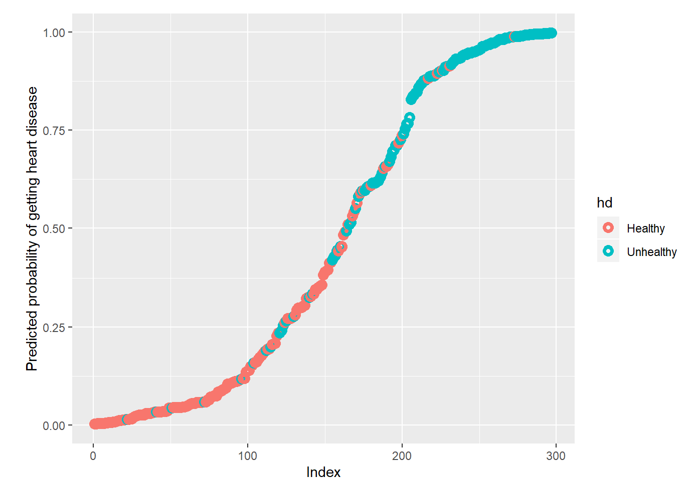

# Logistic Regression Heart Disease Model

_Authors: Andrew Bridglall, Brendan Tong, Darren Jian, Youngjun Oh_

## Description

We wanted to build a logistic regression model to accurately predict heart disease in patients based on data from the [Cleveland Clinic Foundation](http://archive.ics.uci.edu/ml/datasets/Heart+Disease). To do this, we have performed logistic regressions where we first considered multiple potential predictor variables and distilled them into the “best” set of predictors through a model-selection process. In the revised logistic regression, we have only considered the following predictor variables: cp (chest pain), sex, trestbps (resting blood pressure), slope (the slope of the peak exercise ST segment), ca (the number of major blood vessels (0-3) colored by fluoroscopy), thal (thallium stress test result).

Our results indicated that both our original and revised logistic regression models failed the Hosmer-Lemeshow goodness of fit test, suggesting that the models did not sufficiently fit the data. After comparing the deviance residual outputs for both models, we found that the second model’s deviance residuals median was closer to 0 and the minimum and maximum values were more symmetric than those of the first model. Next, we observed that the misclassification error rate for our second model (14.3%) was less than the error rate for our first model (16.1%), which would have indicated accuracy if not for the lack of good fit. Ultimately, while our revised model has reasonable predictive power (>85% prediction accuracy), we must take our models’ reliability and predictions with a grain of salt.

We then put forth a variety of suggestions that may have increased the reliability of our logistic models. First, we believe that having a larger dataset on heart disease, as well as including more variables that were directly linked to heart disease (ie, patient smoking history, obesity and diabetes) would have been more beneficial to building accurate logistic models. Regarding rooms for improvement, we have noticed that partitioning our dataset resulted in the sample size of the testing data being much smaller than the sample size of the training data; this might explain the higher error rates in the testing data compared to the training data. In addition, adjusting the heart disease prediction threshold (50%) may have also resulted in more accurate predictions. Implementing improvements may increase the predictive power of future models on heart disease.

We were in part inspired by [Josh Starmer's helpful video series](https://www.youtube.com/watch?v=C4N3_XJJ-jU) on using logistic regression in R.
